# SCADA Desktop

Aplicación de escritorio desarrollada en **Python 3.8** con **PyQt5**.  
Incluye integración con MongoDB, manejo de expresiones evaluables, colores web, hojas de cálculo Excel, y notificaciones a través del paquete propio **pyqt5-notificator**.

---

## 🚀 Requisitos

- Python **3.8.x**
- pip actualizado
- MongoDB (si la app se conecta a una base de datos real)

---

## 📦 Instalación

1. Clonar o descargar el proyecto:

   ```bash
   git clone https://github.com/tuusuario/scada-desktop.git
   cd scada-desktop
# 🖥️ SCADA Desktop

**SCADA Desktop** es una aplicación de escritorio desarrollada en **Python 3.8** con **PyQt5**, diseñada para la **supervisión y control de variables** en sistemas industriales y de automatización.  
Ofrece una interfaz moderna, soporte de notificaciones en tiempo real y conectividad con bases de datos, permitiendo a los usuarios gestionar datos, alarmas y reportes de forma sencilla.

---

## ✨ Funcionalidades principales

- 🎛️ **Interfaz gráfica moderna e intuitiva**  
  Desarrollada con PyQt5, incluye menús, paneles y ventanas personalizadas.
<p align="center">
  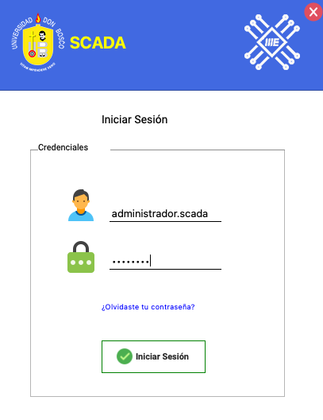
</p>
<p align="center">
  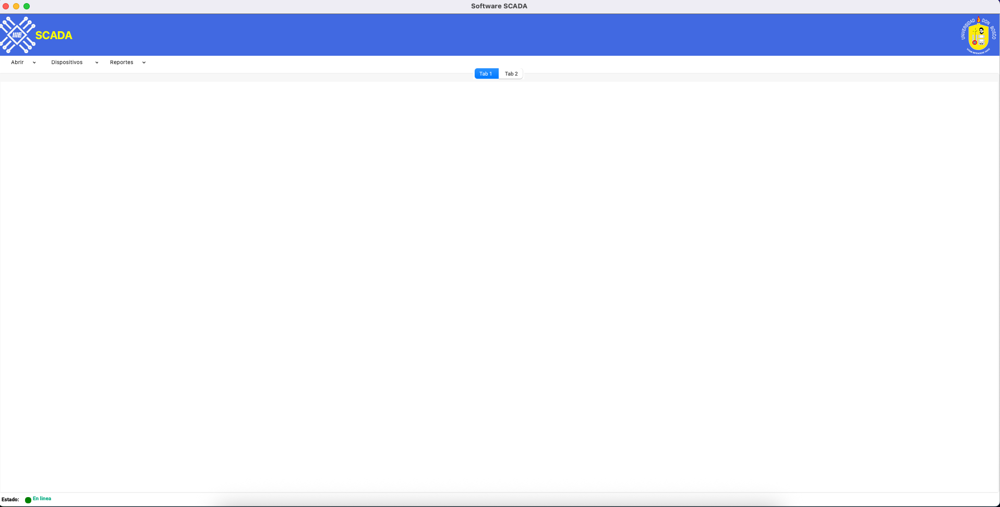
</p>

- 📊 **Monitoreo en tiempo real**  
Visualización de variables analógicas y digitales con actualización en vivo.
<p align="center">
  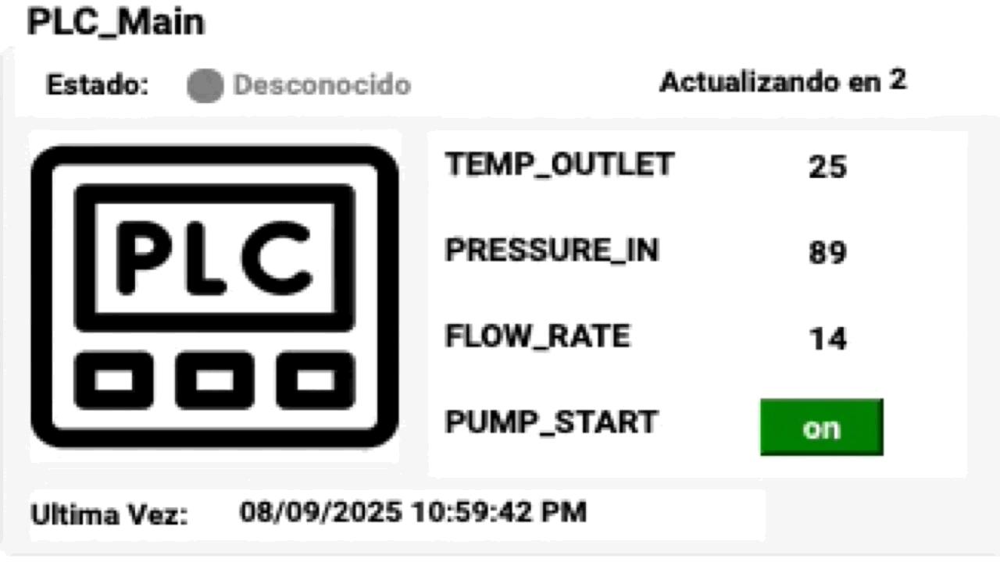
</p>
  
- 🔌 **Conexión con dispositivos externos**  
  Soporte para exportar e importar configuraciones rapidamente
  <p align="center">
  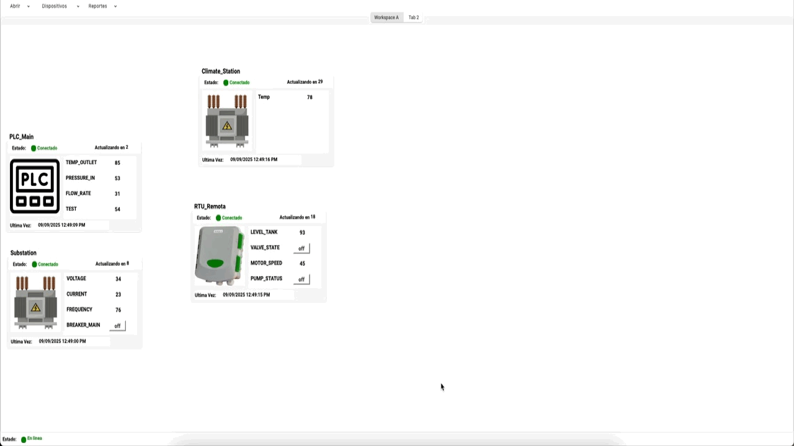
</p>
<p align="center">
  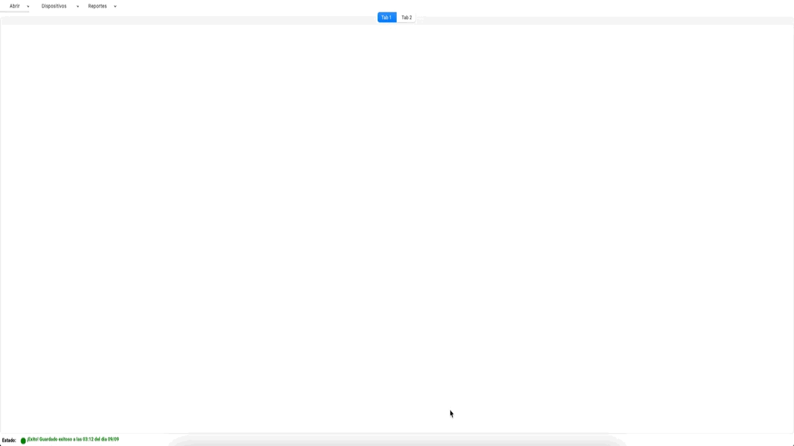
</p>

- 🗂️ **Creacion y edicion de RTUs**  
 Guarde y gestione diferentes espacios de trabajo
<p align="center">
  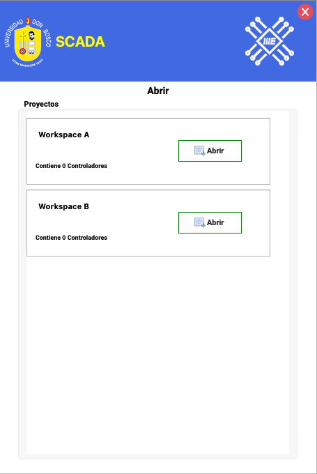
</p>

 Trabaje en mas multiples workspaces a la vez
<p align="center">
  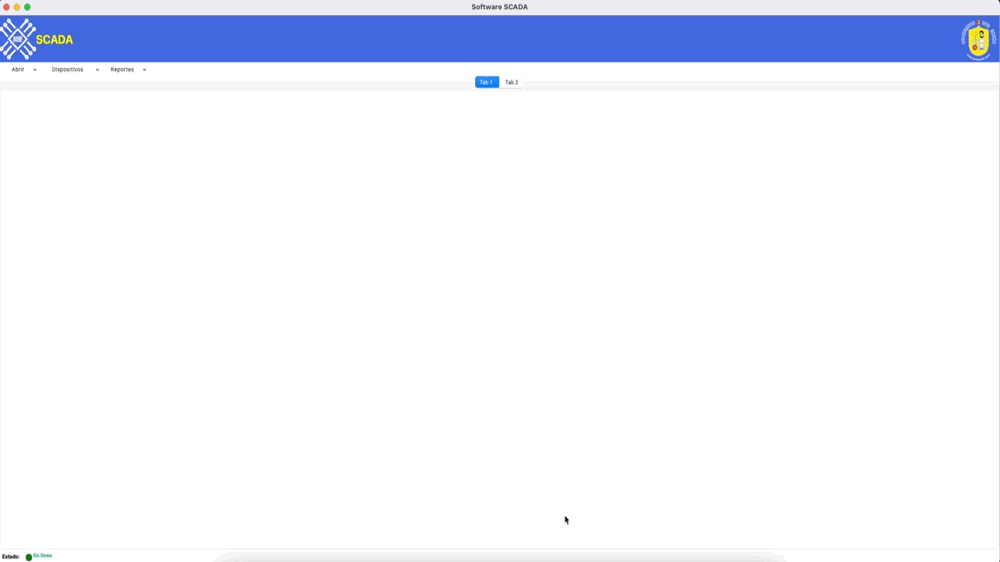
</p>

 Arrastre y ubique a su antojo
<p align="center">
  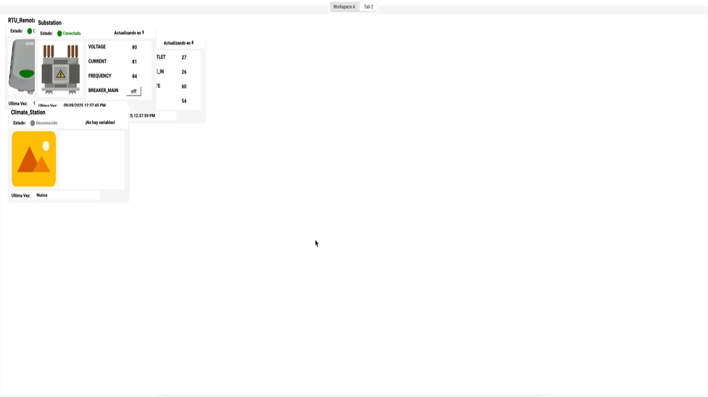
</p>

 Visualice los dispositivos y cree nuevos
<p align="center">
  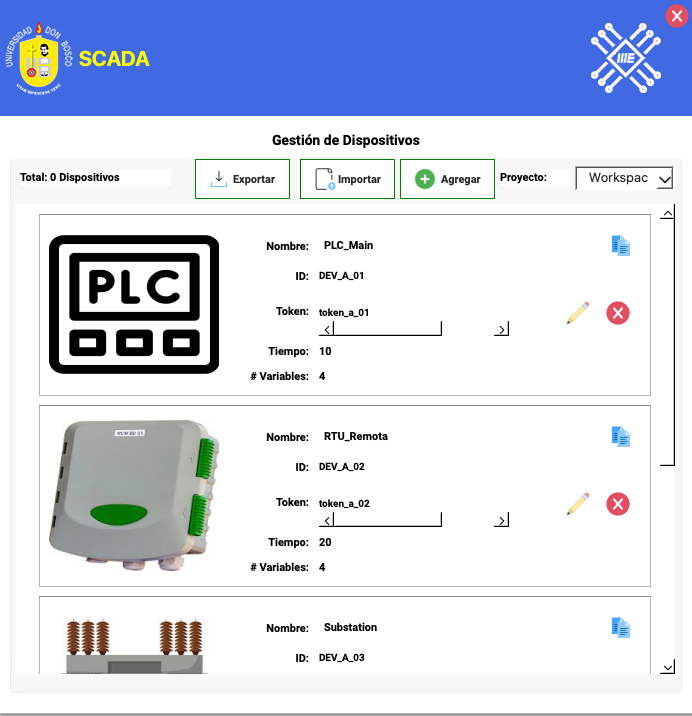
</p>

 Cree y edite RTUs
<p align="center">
  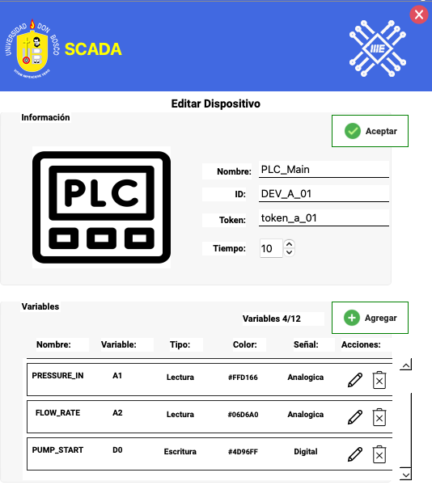
</p>

 Cree nuevas variables
<p align="center">
  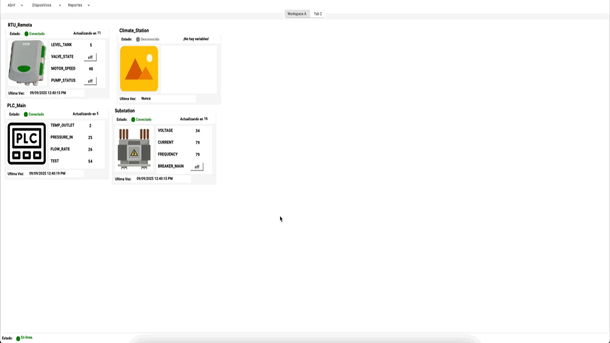
</p>

 Actualice imagen de referencia

<p align="center">
  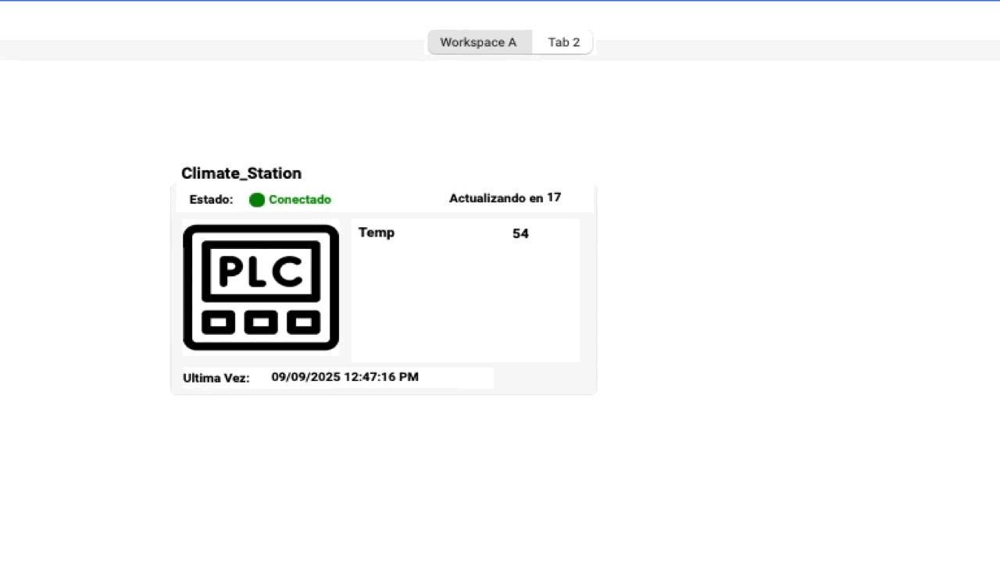
</p>

- **Gestion de usuarios**
Gestione usuarios administradores y normales

<p align="center">
  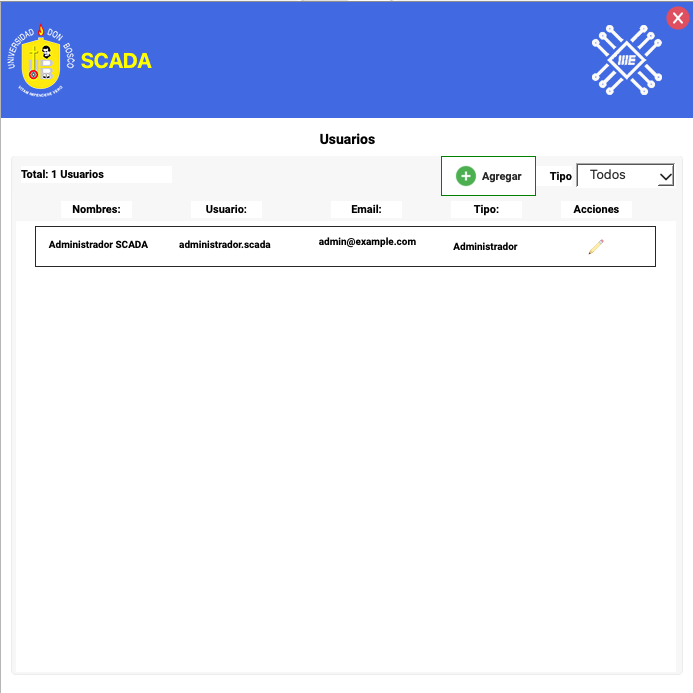
</p>
Registre uno nuevo
<p align="center">
  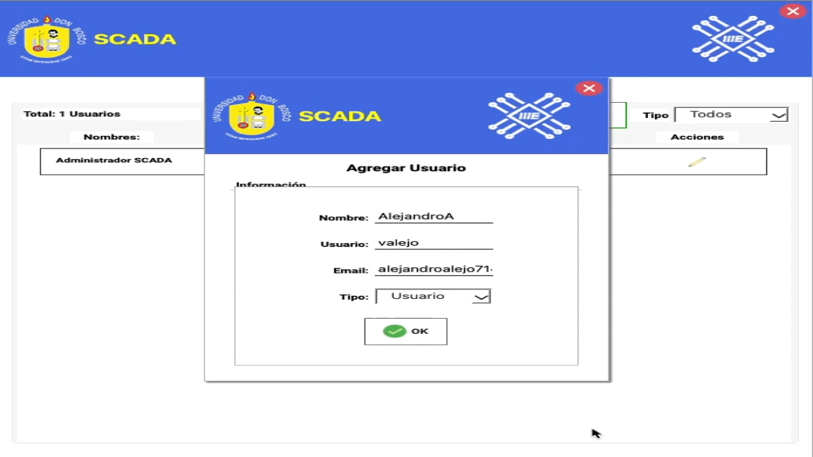
</p>
Reciba su contrase;a por correo
<p align="center">
  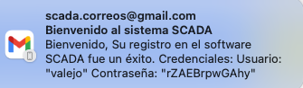
</p>

- 📑 **Exportación de reportes**  
  Posibilidad de exportar datos a formatos como Excel para análisis externo.
<p align="center">
  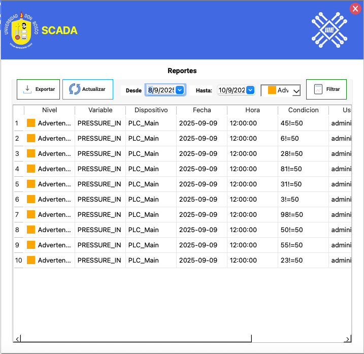
</p>

[📊 Ver reporte en Excel](./docs/report.xlsx)

---

## 🔧 Requisitos

- Python 3.8
- PyQt5
- Dependencias adicionales en `requirements.txt`

Instalación rápida:

```bash
pip install -r requirements.txt